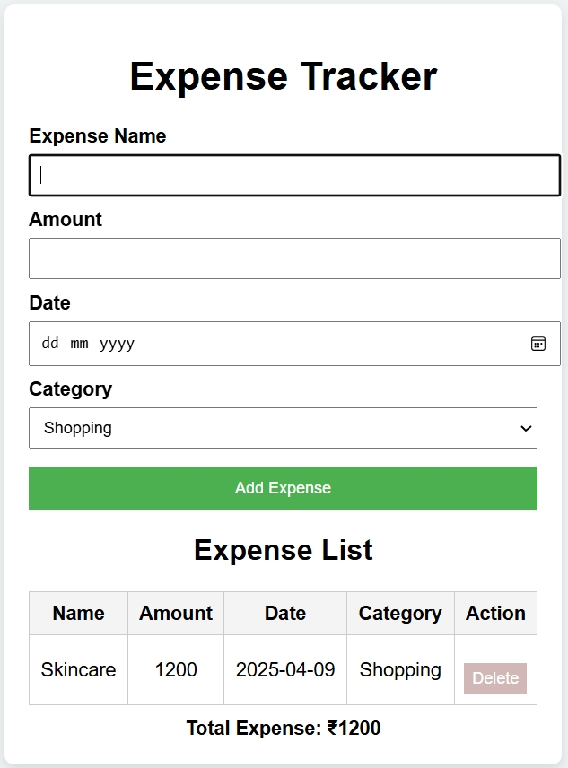

## Overview
The **Expense Tracker** is a basic web application designed especially for beginners who want a simple and effective way to manage their daily finances. It focuses on ease of use rather than complex features, making it ideal for users with little to no experience in financial tracking.

## 🌟 Features
- 🟢 **Clean Green & White UI** — fresh, minimal design for distraction‑free use.  
- ➕ **Add Expenses Easily** — enter amount and a short description.  
- 📋 **Organized Transaction List** — view all expenses in one place.  
- 📊 **Basic Summary** — shows total expenses to help track spending over time.  
- 📱 **Responsive Design** — works smoothly across different devices.  
- 🎯 **Beginner‑Friendly** — no advanced tools or analytics, just simple tracking.  

## 📂 Tech Stack
- **Frontend:** HTML, CSS, JavaScript  
- **Design:** Minimal, clean green & white theme  
- **Focus:** Core expense tracking functionality without complexity

## Screenshot
-### Home Page

